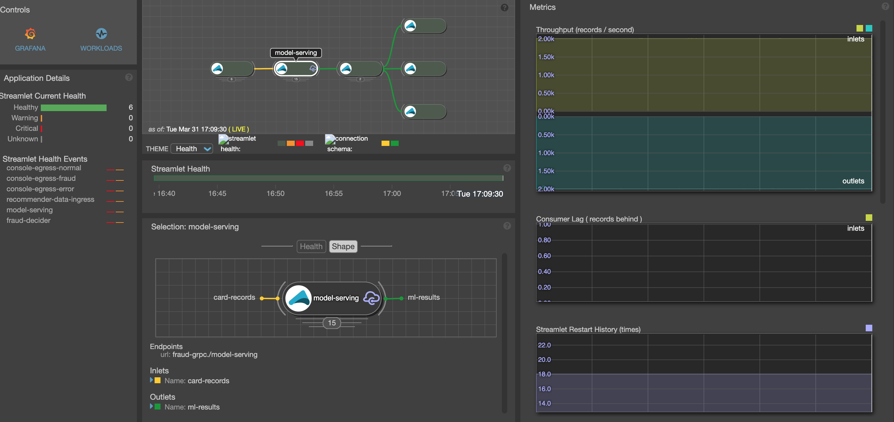
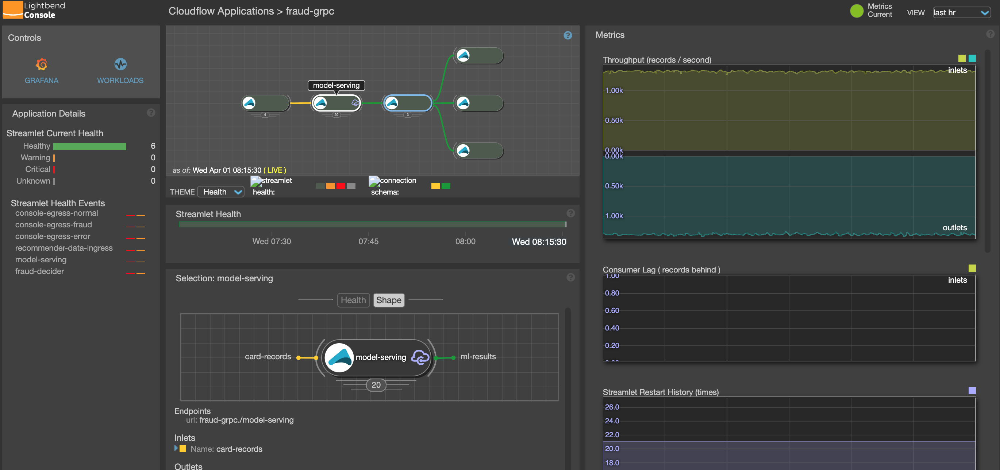
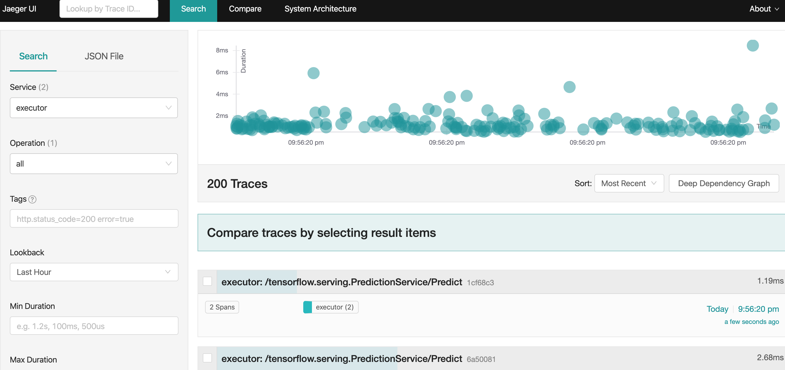
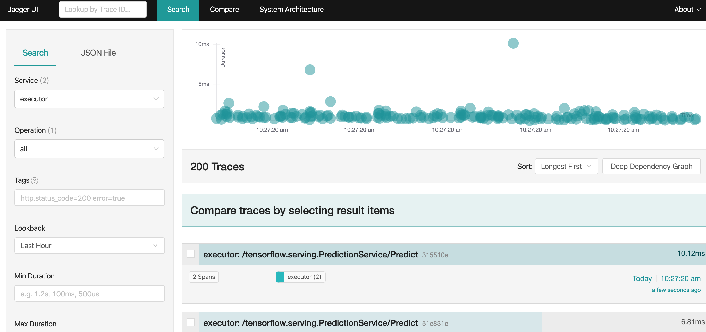

# Seldon Cloudflow integration

[Seldon core](https://www.seldon.io/) is one of the most popular open source machine learning
deployment project allowing to manage, serve and scale models built in any framework on Kubernetes. 
[Cloudflow][https://cloudflow.io/] is a framework that enables you to quickly develop, orchestrate, and operate distributed streaming applications on Kubernetes.
The purpose of this project is to create a demo of how the two can be used together.

## TF GRPC

TF GRPC implementation is based on this [blog post](https://medium.com/@junwan01/a-java-client-for-tensorflow-serving-grpc-api-d37b5ad747aa)
After copying proto files remove this [one](protocol/src/main/protobuf/tensorflow/core/protobuf/conv_autotuning.proto)

## Seldon deployment using Helm

Here are the steps to install Seldon on k8 cluster (based on [this](https://github.com/SeldonIO/seldon-core/blob/master/notebooks/seldon_core_setup.ipynb)). Make sure that you are using Helm3
````
kubectl create namespace seldon
kubectl config set-context $(kubectl config current-context) --namespace=seldon
kubectl create namespace seldon-system
helm install seldon-core seldon-core-operator --repo https://storage.googleapis.com/seldon-charts --set ambassador.enabled=true --set usageMetrics.enabled=true --namespace seldon-system
#helm install seldon-core --set ambassador.enabled=true --set usageMetrics.enabled=true --namespace seldon-system /Users/boris/BigData/seldon-core/helm-charts/seldon-core-operator
kubectl rollout status deploy/seldon-controller-manager -n seldon-system
helm repo add stable https://kubernetes-charts.storage.googleapis.com/
helm repo update
helm install ambassador stable/ambassador --set crds.keep=false
kubectl rollout status deployment.apps/ambassador
````
This will install Seldon and Ambassador

## Seldon deployment using Kustomize

Install Kustomize using
````
brew install kustomize
````
Clone Seldon project
````
git clone git@github.com:SeldonIO/seldon-core.git
````
Go to /operator directory
````
cd seldon-core/operator/
````
***Note*** For kubernetes <1.15 comment the patch_object_selector [here](https://github.com/SeldonIO/seldon-core/blob/master/operator/config/webhook/kustomization.yaml)

Run these 2 commands to install Seldon:
````
make install-cert-manager
make deploy-cert
````
Install Ambassador using (We are using Helm 2 here):
````
kubectl create namespace seldon
kubectl config set-context $(kubectl config current-context) --namespace=seldon
helm repo add stable https://kubernetes-charts.storage.googleapis.com/
helm repo update
helm install --name ambassador stable/ambassador --set crds.keep=false
kubectl rollout status deployment.apps/ambassador
````
## Validate Ambassador install

To validate Ambassador install, run:
````
kubectl port-forward $(kubectl get pods -n seldon -l app.kubernetes.io/name=ambassador -o jsonpath='{.items[0].metadata.name}') -n seldon 8003:8877
````
This will connect to ambassador-admin, which you can see at:

http://localhost:8003/ambassador/v0/diag/

## Creating Seldon TF deployment

To use S3 for model, first create a secret:
````
kubectl create secret generic s3-credentials --from-literal=accessKey=<YOUR-ACCESS-KEY> --from-literal=secretKey=<YOUR-SECRET-KEY>
````
After installation is complete, use deployment yaml files for [Rest](/deployments/model_tfserving_rest.yaml)
and [GRPC](/deployments/model_tfserving_grpc.yaml).

***Note:*** To scale Seldon deployment specify the amount of `replicas` that you need. This will start replicated `SeldonDeployments` accessed through the same service. Typically, in this case, you would also need to scale a streamlet accessing this service.

To verify that REST deployment works correctly, run the following command:
````
curl -X POST http://localhost:8003/seldon/seldon/rest-tfserving/v1/models/recommender/:predict -H "Content-Type: application/json" -d '{"signature_name":"","inputs":{"products":[[1.0],[2.0],[3.0],[4.0]],"users":[[10.0],[10.0],[10.0],[10.0]]}}'
````
To verify GRPC deployment run this [simple test](/grpcclient/src/main/scala/com/lightbend/tf/grpc/SimpleTest.scala)

### Install Jaeger for Tracing

One of the important tools to understand Seldon deployment behavior is usage of tracing via Jaeger (see [here](https://github.com/SeldonIO/seldon-core/blob/master/examples/models/tracing/tracing.ipynb) for an example).

To do this install Jaeger following [this](/deployments/jaegerInstall).
This installs a simple Jaeger [server](/deployments/jaeger.yaml) and [UI](/deployments/jaegerUI.yaml)


## Cloudflow 

Install [cloudflow enterprise installer](https://developer.lightbend.com/docs/cloudflow/current/install/index.html)
For Helm3, here is the sequence of commands to install NFS provisioner:
````
helm repo add stable https://kubernetes-charts.storage.googleapis.com/
helm repo update
helm install nfs-server stable/nfs-server-provisioner
````
Also see [here](https://www.digitalocean.com/community/tutorials/how-to-set-up-readwritemany-rwx-persistent-volumes-with-nfs-on-digitalocean-kubernetes) for more details

To scale pipeline deployment use the following command:
````
kubectl cloudflow scale <app> <streamlet> <n>
````
where:
* `app` is the name of deployed cloudflow application. To get deployed application's names execute `kubectl cloudflow list` 
and pick the appropriate application, for example, `seldon-grpc`
* `streamlet` is streamlet name, as defined in the blueprint, for example, `model-serving` 
* `n` - the amount of required instances of streamlet, for example, `5`

Install [Ingress](/deployments/NGNIXIngressInstall)

Install [LB console Ingress](/deployments/es-console.yaml)

Build and deploy pipelines following [documentation](https://cloudflow.io/docs/current/get-started/deploy-to-gke-cluster.html)

Create ingresses for models serving statistics using the following [yaml file](/deployments/modelservers.yaml)

Note that Kafka install by cloudflow is setting `log.retention.hours: -1`, which means indefinitely. This can lead to filling Kafka disks especially if there is a high 
frequency of writes. The following can be done to fix situation. Delete cloudflow install
```` 
kubectl delete cloudflow -n cloudflow default
```` 
Reinstall cloudflow using bootstrap script

## Avro tensor

To simplify usage of the tensorflow that is all based on Tensors, this project implements Avro Tensor support, which consists of 2 main parts:
* Avro Tensor definitions, that is located [here](support/src/main/avro/tensor/core), which is modeled after protobuf Tensor definitions
* [Avro Tensor converter](support/src/main/scala/com/lightbend/seldon/converters/TensorConverter.scala),
which provide conversion between Avro tensor representations and other tensor representation commonly used 
(protobufs, JSON, Tensors from Tensorflow Java library)

Usage of this code allows for building of "standard" independent of actual model [message definitions](support/src/main/avro/tensor/recommender), and much simpler implementation 
of executors. 

## Fraud detection

Training notebook is [here](/frauddetector/python/FraudDetection.ipynb).
Training data (used for serving as well) is [here](/data/fraud/data/creditcard.zip)
Resulting model (based on Autoencoder) is [here](/data/fraud/model).

To quickly test the model run it locally using tensorflow serving:
````
docker run -p 8501:8501 --rm --name tfserving_fraud --mount type=bind,source=/Users/boris/Projects/TFGRPC/data/fraud/model,target=/models/fraud -e MODEL_NAME=fraud -t tensorflow/serving:1.14.0
```` 
Once this is done, validate deployment using:
````
http://localhost:8501/v1/models/fraud/versions/1
http://localhost:8501/v1/models/fraud/versions/1/metadata
````
To try prediction, you can try:
````
curl -X POST http://localhost:8501/v1/models/fraud/versions/1:predict -d '{"signature_name":"","inputs":{"transaction":[[-1.3598071336738,-0.0727811733098497,2.53634673796914,1.37815522427443,-0.338320769942518,0.462387777762292,0.239598554061257,0.0986979012610507,0.363786969611213,0.0907941719789316,-0.551599533260813,-0.617800855762348,-0.991389847235408,-0.311169353699879,1.46817697209427,-0.470400525259478,0.207971241929242,0.0257905801985591,0.403992960255733,0.251412098239705,-0.018306777944153,0.277837575558899,-0.110473910188767,0.0669280749146731,0.128539358273528,-0.189114843888824,0.133558376740387,-0.0210530534538215,149.62]]}}'
````
##Useful commands
Remove all evicted pods:
````
kubectl get pods | grep Evicted | awk '{print $1}' | xargs kubectl delete pod
````

##GRPC Load Balancing

As explained [here](https://github.com/grpc/grpc/blob/master/doc/load-balancing.md) 
there are several main approaches to GRPC load balancing:
* Client load balancing
* Proxy load balancing

Ambassador is serving as an external load balancing service. To test its capabilities and compare them to other options,
we have a simple implementation of [client load balancing](support/src/main/scala/com/lightbend/seldon/executors/tensor/lb),
which follows implementation [here](https://github.com/saturnism/grpc-by-example-java/tree/master/kubernetes-lb-example).
This implementation is very limited (watcher does not quite work, grpc version is old, etc), but is good enough for initial 
performance testing (below)

##Performance testing

###Load balanced direct TFServing GRPC

Deployment - 15 TF servers, bases on this [configuration](deployments/tfserving.yaml), 15 Model serving servers

###Load balanced direct Seldo with TFServing GRPC

Deployment - 15 Seldon TF servers, bases on this [configuration](deployments/fraud_tfserving_grpc.yaml), 15 Model serving servers. The important thing here
is to make sure that Seldon deployment enough resources. Without this, although Seldon will seem to be working, it will start slowing down processing
due to shortage of resources.

##Seldo with TFServing GRPC accesed through load balanced Ambassador access

Deployment - 15 Seldon TF servers, bases on this [configuration](deployments/fraud_tfserving_grpc.yaml), 20 Model serving servers. 15 Ambassador servers.
Here the throughput is lower, but this is expected due to additional network hop.
Note that Seldon execution time, in this case, does not really grow 


##Seldo with TFServing GRPC accesed through Ambassador without load balancer

Deployment - 15 Seldon TF servers, bases on this [configuration](deployments/fraud_tfserving_grpc.yaml), 20 Model serving servers. 15 Ambassador servers.
Note that Seldon execution time, in this case, does not really grow either 

Here, although we are not using GRPC load balancing for acessing Ambassador, we are getting even better throughput compared
to the previous case. As described in this [article](https://grpc.io/blog/grpc-load-balancing/):

"In Proxy load balancing, the client issues RPCs to the a Load Balancer (LB) proxy. The LB distributes the RPC call to one of the available backend servers that implement the actual logic for serving the call."

This means that effectively Ambassador implements external load balancing service pattern.


Copyright (C) 2020 Lightbend Inc. (https://www.lightbend.com).

